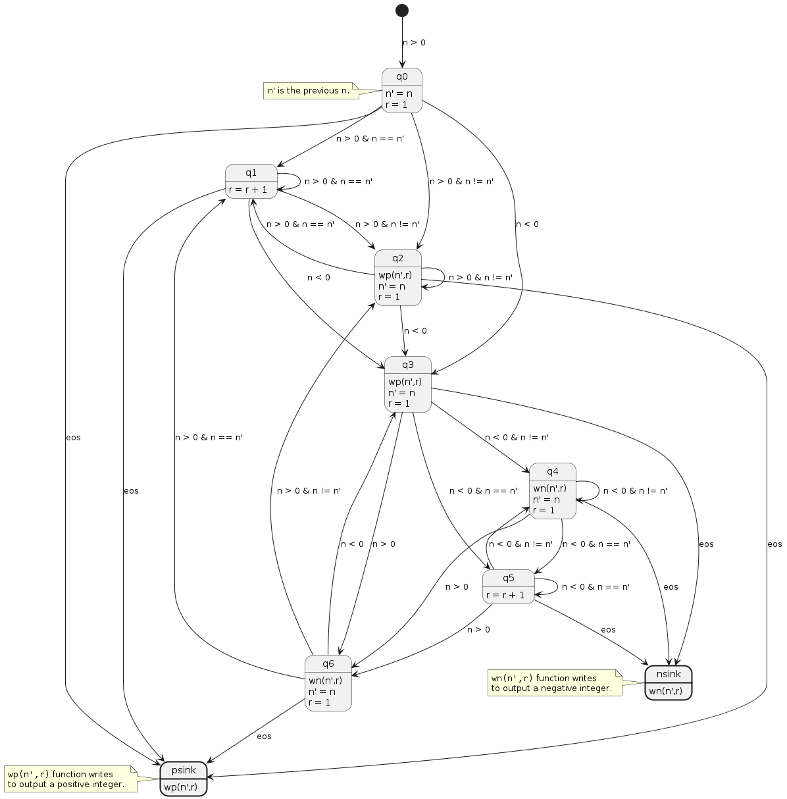
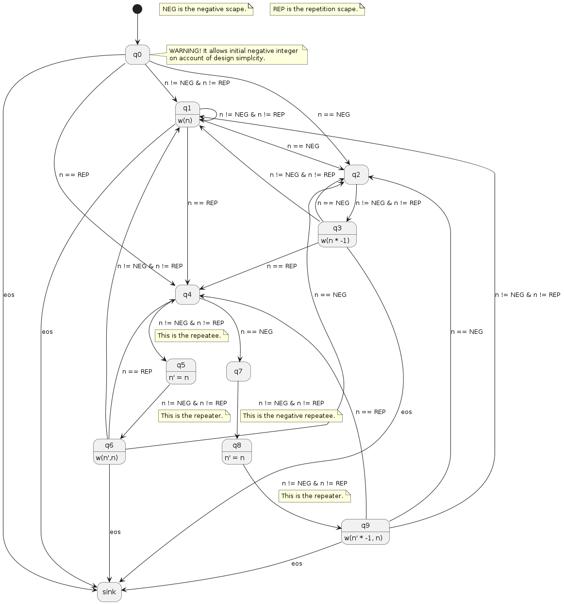

[](https://opensource.org/licenses/BSD-2-Clause)
[](https://shields.io/)

# Introduction

The following is the detail of one-header libraries available in this repository:
* `codecs`:
  * `qmx.hpp`: It is an unsigned 32-bits integer encoder/decoder modified from [@amallia's QMX repository](https://github.com/amallia/QMX). A mechanism to get a set of integers from a 128-bits `SIMD` word at a time was added. Copyright © 2014-2017 Andrew Trotman under the [BSD-2-Clause](https://opensource.org/license/bsd-2-clause/) licence. The implementation is based on:
  > A. Trotman and J. Lin, "In Vacuo and In Situ Evaluation of SIMD Codecs," in Proceedings of the 21st Australasian Document Computing Symposium, in ADCS ’16. New York, NY, USA: Association for Computing Machinery, Dec. 2016, pp. 1–8. doi: 10.1145/3015022.3015023. 
  * `gr-codec.hpp`: It contains an implementation of ***Rice-runs***, ***Golomb-Rice*** and ***Rice*** (exclusive *Rice* implementation based on [`uiuiHRDC` library](https://github.com/migumar2/uiHRDC)) codecs. The library [sdsl-lite](https://github.com/simongog/sdsl-lite) is required! The following classes and functions are available:
    * `enum GRCodecType`: Available values are `GOLOMB_RICE`, and `EXPONENTIAL_GOLOMB`. However, at the moment `GOLOMB_RICE` is operative only. 
    * `template<typename Word, typename Length = std::uint64_t> class RCodec`: Based on [`uiuiHRDC` library](https://github.com/migumar2/uiHRDC).
      * `RCodec<Word,Length>::BinarySequence`: Struct that represents a binary sequence.
        * `RCodec<Word,Length>::BinarySequence( const std::string file_name )`: Retrieve a serialized binary sequence from a file.
        * `RCodec<Word,Length>::BinarySequence( const std::size_t k )`: Builds an empty binary sequence.
        * `RCodec<Word,Length>::BinarySequence( Word *sequence, const Length sequence_length, const Length src_length, const std::size_t k )`: Builds a binary sequence from its basic components. 
        * `void add( Word n, std::size_t n_bits )`: Appends a new `n_bits`-long element in the binary sequence.
        * `void save( std::string file_name )`: Serializes the current binary sequence to a specified file.
      * `RCodec( RCodec<Word,Length>::BinarySequence bs )`: Builds a `RCodec` based on a specified binary sequence. 
      * `RCodec( const std::size_t k )`: Builds an empty `RCodec`.
      * `RCodec( Word *sequence, const Length sequence_length, const Length src_length, const std::size_t k )`: Builds a `RCodec` using basic components of a `RCodec<Word,Length>::BinarySequence`.
      * `static std::size_t compute_GR_parameter_for_list( std::vector<Word> sequence )`: Helps to compute an efficient `k` parameter given a list of elements to encode.
      * `static RCodec<Word,Length>::BinarySequence encode( std::vector<Word> sequence, const std::size_t k )`: This function encodes an integer `n`.
      * `static std::vector<Word> decode( RCodec<Word,Length>::BinarySequence &bs )`: This function allows decoding an integer encoded as a bitmap.
      * `void append(const Word n)`: This function allows appending the encoded representation of `n` to an internal bitmap.
      * `const Word next()`: This function iterates on the internal bitmap as decodes and returns the next integer. 
      * `void restart()`: This function restarts the iteration on the internal bitmap.
      * `RCodec<Word,Length>::BinarySequence get_binary_sequence() const`: This function returns a copy of the internal bitmap.
      * `const Length length()`: This function returns the number of stored bits.
      * `const Length size()`: This function returns the number of encoded integers.
      * `const Length get_current_iterator_index()`: This function returns the current iterator index.
      * `static void display_binary_sequence( std::string info, RCodec<Word,Length>::BinarySequence bs, bool show_bitmap = true )`: This function displays the bitmap and the metadata of a `RCodec<Word,Length>::BinarySequence`.
    * `template<typename Type> class GRCodec`:
      * `static sdsl::bit_vector encode(const Type n, const std::size_t m, GRCodecType type = GRCodecType::GOLOMB_RICE )`: This static function allows encoding an integer `n`.
      * `static Type decode(sdsl::bit_vector v, const std::size_t m, GRCodecType type = GRCodecType::GOLOMB_RICE )`: This static function allows decoding an integer encoded as a bitmap `v`.
      * `append(const Type n)`: This function allows appending the encoded representation of `n` to an internal bitmap.
      * `const Type next()`: This function iterates on the internal bitmap as decodes and returns the next integer. 
      * `const bool has_more()`: This function verifies whether the internal bitmap has or doesn't have more codewords to iterate on.
      * `void restart()`: This function restarts the iteration on the internal bitmap.
      * `const sdsl::bit_vector get_bit_vector()`: This function returns a copy of the internal bitmap.
      * `const std::size_t length()`: This function returns the number of stored bits.
      * `const std::uint64_t get_current_iterator_index()`: This function returns the current iterator index.
    * `template<typename Word> class RiceRuns`: This class represents a *Rice-runs* encoding of integers of type Word. This codec uses `RCodec` class to encode codewords.
      * `RiceRuns( typename RCodec<Word,Length>::BinarySequence bs )`: Builds a `RiceRuns` object based on a `RCodec<Word,Length>::BinarySequence`.
      * `RiceRuns( const std::size_t k )`: Builds an empty `RiceRuns` object based on the *Rice* parameter `k`.
      * `RiceRuns( Word *sequence, const Length sequence_length, const Length src_length, const std::size_t k )`: Builds a `RiceRuns` object using basic components of a `RCodec<Word,Length>::BinarySequence`.
      * `static void encode(const std::vector<Word> sequence, const std::size_t k )`: This static function encodes a sequence of Word integers using *Rice-runs*. The following is the FSM used by this function:
  
		

		> `eos` stands for ***end of sequence***. 
		> 
		> `n` represents an input.
		>
		> `n'` represents a previous input.  
		>
		> `r` represents the repetitions of an input.
		>
		> `wp(a,b)` is a function to output `b` times the positive number `a`.
		>
		> `wn(a,b)` is a function to output `b` times the negative number `a`.

      * `static std::vector<Word> decode( typename RCodec<Word,Length>::BinarySequence bs  )`: This static function decodes an encoded sequence of Word integers using *Rice-runs*.
      * `static std::vector<Word> decode( sdsl::bit_vector encoded_sequence, const std::size_t k )`: This static function decodes an encoded sequence of Word integers using *Rice-runs*. The following is the FSM used by this function:
		
		

		> `eos` stands for ***end of sequence***. 
		>
		> `n` represents an input.
		>
		> `n'` represents a previous input. 
		>
		> `w(a)` is a function to output `a`.
		>
		> `w(a,b)` is a function to output `b` times `a`.
    
      * `typename RCodec<Word,Length>::BinarySequence get_encoded_sequence()`: This function returns the Rice encoded bitmap.
      * `sdsl::bit_vector get_encoded_sequence()`: This function returns the ***Golomb-Rice*** encoded bitmap.
      * `void set_encoded_sequence( typename RCodec<Word,Length>::BinarySequence bs )` and `void set_encoded_sequence( Word *sequence, const Length sequence_length, const Length src_length, const std::size_t k )`: These functions sets the internal encoded sequence.
      * `const Word next()`: This function allows retrieving one by one positive integers from the *Rice-runs* encoded internal bitmap. 
      * `void restart_encoded_sequence_iterator()`: This function restarts the traversal of the encoded sequence.
      * `bool has_more()`: This function returns whether the internal encoded sequence has more codewords to decode or not.

    * Additionally, the file [`gr-codec-test.cpp`](https://github.com/sebastianamg/samgutx/blob/main/codecs/gr-codec-test.cpp) contains test cases used to check the correctiveness of both ***Golomb-Rice*** and ***Rice-runs*** implementations. It uses [Google Test](http://google.github.io/googletest/) library. To compile this file, use the following command: `g++-11 -ggdb -g3 -I ~/include/ -L ~/lib/ gr-codec-test.cpp -o gr-codec-test -lsdsl -lgtest`.


* `samg`:
  * `commons.hpp`: It contains methods for converting objects and vectors to string (the object requires implementing `operator<<`), printing a vector, array and queue, copying data to a `std::stack` from a range defined by `begin` and `end` iterators, and converting a number (`std::double_t`) to string providing a precision ($0$ is the default).
  * `logger.hpp`: It contains a wrap class for [`c-logger`](https://github.com/adaxiik/c-logger) implemented by @adaxiik. The wrapper class, called `samg::Logger` provides with methods to output `debug`, `info`, `warn`, `error`, and `fatal` messages, along with a method to directly output a `stdout` message. Furthermore, it provides with a mechanism to "turn" on and off the logger. Since this is a one-header file, @adaxiik's `c-logger` has been replicated within the file. 
  * `matutx.hpp`: It provides functions and a class to serialize a sequence of integers called `WordSequenceSerializer`. Available functions and a class are as follows:
    * `FileFormat identify_file_format(const std::string file_name)`: This function allows identifying a file extension based on the input file name. Available formats are defined by the `enum FileFormat`. 
    * `std::string append_info_and_extension(const std::string file_name, const std::string to_append,const std::string new_ext)`: This function allows appending a string to and replace the extension of a file name. 
    * `std::string change_extension(const std::string file_name, const std::string new_ext)`: This function allows replacing the extension of a file name by a new one, regardless the previous extension is.
    * `std::string change_extension(const std::string file_name, const std::string old_ext, const std::string new_ext)`: This function allows replacing a given old extension of file name by a new one.
    * `WordSequenceSerializer` class: This class allows serializing and deserializing a sequence of integers defined through its template. The class provides the following members:
      * `WordSequenceSerializer()`: This constructor gets the serializer ready to start a new serialization. 
      *  `WordSequenceSerializer(const std::string file_name)`: This constructor builds a serializer with data retrieved from a binary file.
      * `WordSequenceSerializer( std::vector<Type> sequence)`: This constructor builds a serialized from a serialized sequence.
      * `template<typename TypeSrc, typename TypeTrg = Type> std::vector<TypeTrg> parse_values(std::vector<TypeSrc> V)`: This function allows parsing integer values stored in an input vector of type TypeSrc into type TypeTrg.
      * `template<typename TypeSrc, typename TypeTrg=Type> TypeTrg parse_value(TypeSrc v)`: This function allows parsing an integer value of type TypeSrc into type TypeTrg.
      * `template<typename TypeSrc> void add_value(TypeSrc v)`: This function allows adding an `8`/`16`/`32`/`64`-bits value. 
      * `template<typename TypeSrc = Type, typename TypeLength = std::size_t> void add_values(const TypeSrc *v, const TypeLength l)`: This function allows adding a collection of l unsigned integer values.
      * `template<typename TypeSrc> void add_values(const std::vector<TypeSrc> V)`: This function allows adding a collection of unsigned integer values. 
      * `void add_value(std::string v)`: This function allows serializing a string.
      * `void add_map_entry(const std::pair<std::string,std::string> p)`: This function allows adding a `std::map<std::string,std::string>` entry.
      * `void add_map(std::map<std::string,std::string> m)`: This function allows adding a `map<std::string,std::string>`.
      * `void save(const std::string file_name)`: This function allows saving the serialization into a given file. 
      * `template<typename TypeTrg = Type> const std::vector<TypeTrg> get_remaining_values()`: This function allows getting remaining values from the serialization, starting from where an internal index is.
      * `template<typename TypeTrg = Type> const std::vector<TypeTrg> get_next_values(std::uint64_t length)`: This function allows retrieving the next `length` values of type `TypeTrg`.
      * `template<typename TypeTrg = Type> const std::vector<TypeTrg> get_values(std::uint64_t beginning_index, std::uint64_t length)`: This function allows retrieving the next `length` values of type `TypeTrg` starting at `beginning_index`..
      * `template<typename TypeTrg = Type> const Type get_value_at( std::uint64_t i )`: This function allows getting the `i`-th `TypeTrg` type value from the serialization. 
      * `template<typename TypeTrg = Type> const TypeTrg get_value()`: This function allows retrieving the next value, based on an internal index.
      * `std::string get_string_value()`: This function allows retrieving a serialized string. 
      * `std::pair<std::string,std::string> get_map_entry()`: This function allows retrieving a serialized `std::map<std::string,std::string>`'s entry.
      * `std::map<std::string,std::string> get_map()`: This function allows retrieving a serialized `std::map<std::string,std::string>`.
      * `const bool has_more() const`: This method allows verifying whether the serialization has or not more elements. 
      * `const std::uint64_t get_current_index() const`: This method returns the current internal index.
      * `const std::uint64_t size() const`: This method returns the number of Type words that composes the serialization. 
      * `std::vector<Type> get_serialized_sequence()`: This function returns the internal serialized sequence.
      * `const void print()`: This method displays the sequence of Type words that compose the serialization.

# Examples

## `codecs/samg::grcodec::RCodec` and `codecs/samg::grcodec::RiceRuns`

```c++
// riceruns-test.cpp
// To Compile: g++-11 -ggdb -g3 -Wno-register -I ~/include/ -L ~/lib/ riceruns-test.cpp -o riceruns-test -lsdsl

#include <codecs/gr-codec.hpp>
#include <samg/commons.hpp>
#include <samg/matutx.hpp>
#include <iostream>
#include <string>
#include <sstream>
#include <array>
#include <random>

using Word = std::uint32_t;
using Length = std::uint64_t;

// Encode and decode each vector using k.
void run_test( std::string info, std::string file_name, std::vector<Word> sequence, const std::size_t k ) {
    std::cout << info << std::endl;
    
    // Encode:
    std::queue<Word> tmp;
    for (std::size_t i = 0; i < sequence.size(); ++i) {
        tmp.push( sequence[i] );
    }

    samg::grcodec::RCodec<Word,Length>::BinarySequence bs = samg::grcodec::RiceRuns<Word,Length>::encode( tmp, k );
    samg::grcodec::RCodec<Word,Length>::display_binary_sequence( "..::Rice-runs Encoded Sequence::..", bs, false );

    // Serializing binary sequence to file:
    bs.save(file_name);

    // Retrieving binary sequence from file:
    samg::grcodec::RCodec<Word,Length>::BinarySequence bs2 = samg::grcodec::RCodec<Word,Length>::BinarySequence(file_name);
    samg::grcodec::RCodec<Word,Length>::display_binary_sequence( "..::Rice-runs Retrieved Encoded Sequence::..", bs2, false );

    samg::grcodec::RiceRuns<Word,Length> codec( bs2 );
    
    // Compare original and decoded sequences:
    bool same = true;
    
    for ( Length i = 0; same && i < sequence.size(); ++i ) {
        Word n = codec.next();
        same = sequence[i] == n;
        if( !same ) {
            std::cerr << "sequence["<<i<<"]<"<<sequence[i]<<"> != n<"<<n<<">" << std::endl;
        }
    }
    if( same ) {
        std::cout << "Test: Successful!" << std::endl;
    } else {
        std::cerr << "Test: Wrong!" << std::endl;
    }
    std::cout << "---------------------------------------------------------------" << std::endl;
}

int main(int argc, char const *argv[]) {
    if( argc == 1 ) {
        std::cerr << "You must specify a number of elements to generate and a range width for random numbers." << std::endl;
        return 1;
    }
    const Length N = std::stoull(argv[1]); // Sequence length N.
    const Length R = std::stoull(argv[2]); // Random numbers range [0,R)
    std::vector<Word> sequence;

    // Generating random sequence:
    std::random_device rd;
    std::mt19937_64 gen(rd());
    std::uniform_int_distribution<Word> dist(0,R-1);
    sequence.clear();
    for (Word i = 0; i < N; ++i) {
        sequence.push_back(dist(gen));
    }

    std::size_t k = samg::grcodec::RCodec<Word,Length>::compute_GR_parameter_for_list(sequence);
    run_test( "..::Random Sequence Test::.. (k="+std::to_string(k)+")", "trial_riceruns4-rnd.rrn", sequence, k );

    return 0;
}

```

## `codecs/samg::grcodec::GRCodec`

```c++
// gr-test.cpp
// To compile: `g++-11 -ggdb -g3 -I ~/include/ -L ~/lib/ gr-test.cpp -o gr-test -lsdsl`
#include <codecs/gr-codec.hpp>
#include <iostream>
#include <sstream>

void show_bitvector(sdsl::bit_vector v) {
    for (std::size_t i = v.size()-1; 0 <= i && i < v.size() ; --i) {
        std::cout << v[i];
    }
}

int main(int argc, char const *argv[]) {
    const std::size_t m = 7;
    std::cout << "m = "<< m <<"" << std::endl;
    samg::grcodec::GRCodec<std::uint32_t> codec(m,samg::grcodec::GRCodecType::GOLOMB_RICE);
    
    for (std::uint32_t j = 0ul; j < 100ul; j++) {
        codec.append(j);
        std::cout << "\t GR( " << j << " ) " << " |bits|= " << codec.length() << " ---> " << codec <<std::endl;
    }
    
    while( codec.has_more() ) {
        std::cout << "\t next = " << codec.next() << " |bits|= " << codec.length() << " ---> " << codec <<std::endl;
    }

    return 0;
}
```

# Licence

All the software of this repository is licenced under the [BSD-2-Clause](https://opensource.org/license/bsd-2-clause/) as follows:

> Copyright (c) 2023 Sebastián AMG (@sebastianamg)
>
> Redistribution and use in source and binary forms, with or without modification, are permitted provided that the following conditions are met:
> 1. Redistributions of source code must retain the above copyright notice, this list of conditions and the following disclaimer.
> 2. Redistributions in binary form must reproduce the above copyright notice, this list of conditions and the following disclaimer in the documentation and/or other materials provided with the distribution.
>
> THIS SOFTWARE IS PROVIDED BY THE COPYRIGHT HOLDERS AND CONTRIBUTORS “AS IS” AND ANY EXPRESS OR IMPLIED WARRANTIES, INCLUDING, BUT NOT LIMITED TO, THE IMPLIED WARRANTIES OF MERCHANTABILITY AND FITNESS FOR A PARTICULAR PURPOSE ARE DISCLAIMED. IN NO EVENT SHALL THE COPYRIGHT HOLDER OR CONTRIBUTORS BE LIABLE FOR ANY DIRECT, INDIRECT, INCIDENTAL, SPECIAL, EXEMPLARY, OR CONSEQUENTIAL DAMAGES (INCLUDING, BUT NOT LIMITED TO, PROCUREMENT OF SUBSTITUTE GOODS OR SERVICES; LOSS OF USE, DATA, OR PROFITS; OR BUSINESS INTERRUPTION) HOWEVER CAUSED AND ON ANY THEORY OF LIABILITY, WHETHER IN CONTRACT, STRICT LIABILITY, OR TORT (INCLUDING NEGLIGENCE OR OTHERWISE) ARISING IN ANY WAY OUT OF THE USE OF THIS SOFTWARE, EVEN IF ADVISED OF THE POSSIBILITY OF SUCH DAMAGE.